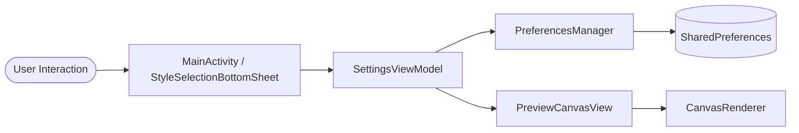
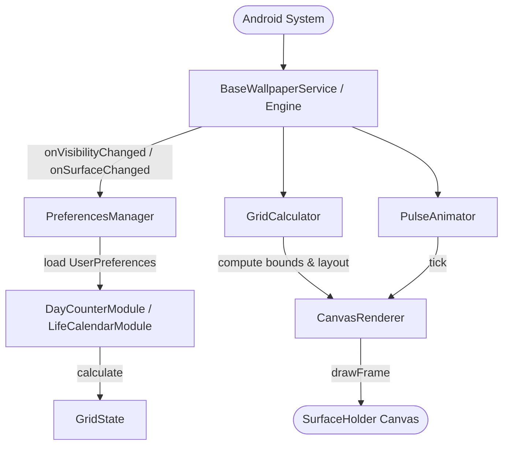
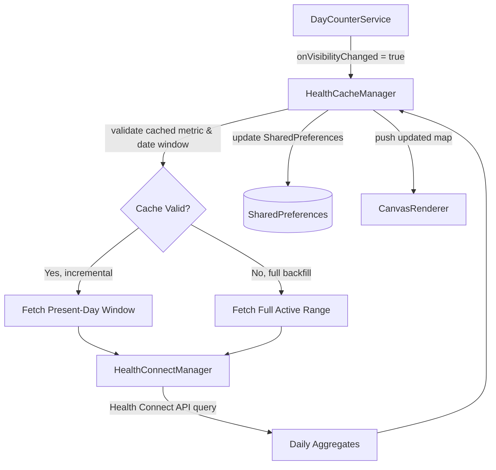
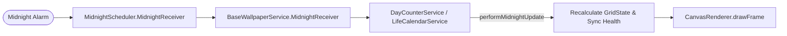

# Project Map

Source tree layout, module responsibilities, and runtime data flows for Perspective - Live.

## High-Level Architecture

The application comprises two core subsystems:

1. **Configuration UI (`settings`)**: An Activity and BottomSheet-based MVVM interface for configuring wallpaper modes (Macro and Micro), color schemes, geometry, and health tracking.
2. **Live Wallpaper Engine (`service` & `rendering`)**: Android `WallpaperService` implementations rendering real-time geometric timelines to the system wallpaper surface via Canvas.

## Source Map

Root namespace: `com.perspectivelive.wallpaper` in `app/src/main/kotlin/com/perspectivelive/wallpaper/`.

### Subpackages

| Package | Purpose | Key Classes |
| --------- | --------- | ------------- |
| `data` | Models, state, palettes, and persistent storage | `UserPreferences`, `PreferencesManager`, `GridState`, `GridConfig`, `StyleConfig`, `ColorScheme`, `ColorSchemeProvider`, `WallpaperTheme`, `CustomColorScheme`, `DayCounterMode`, `HealthCacheManager` |
| `modules` | Domain business logic and date countdown calculations | `CountdownModule`, `DayCounterModule`, `LifeCalendarModule`, `ModuleRegistry` |
| `rendering` | Canvas drawing, geometry layout, and animation drivers | `CanvasRenderer`, `GridCalculator`, `PulseAnimator`, `RenderItemParams` |
| `service` | Android `WallpaperService` lifecycles and background sync | `BaseWallpaperService`, `LifeCalendarService`, `DayCounterService`, `HealthConnectManager`, `MidnightScheduler` |
| `settings` | UI layer, ViewModel, bottom sheets, color pickers | `MainActivity`, `SettingsViewModel`, `StyleSelectionBottomSheet`, `PreviewCanvasView`, `ColorCardAdapter`, `ColorSchemeAdapter`, `CustomColorActivity`, `ColorPickerDialog` |
| `utils` | Date arithmetic and color manipulation utilities | `DateCalculator`, `ColorUtils` |

### Key Project Assets & Configs

- `app/src/main/AndroidManifest.xml`: Declares wallpaper services (`LifeCalendarService`, `DayCounterService`), permissions (Health Connect, Alarm), and settings activity.
- `app/src/main/res/font/`: Bundled `Geist` typeface files (`geist_regular.ttf`, `geist_bold.ttf`, `geist.xml`).
- `design/app_icon.svg`: Master vector app icon (2x2 living grid matrix).
- `config/detekt/detekt.yml`: Detekt static analysis configuration.
- `.github/workflows/`: CI/CD workflows for PR builds (`android-pr-build.yml`) and tagged releases (`android-release.yml`).
- `docs/`: Web landing page and live interactive demo.

## Data Flows

### 1. Settings Configuration Flow

### 2. Wallpaper Lifecycle & Rendering Flow

### 3. Health Connect Sync Flow (Micro Day Counter)

### 4. Midnight Boundary Rollover Flow

